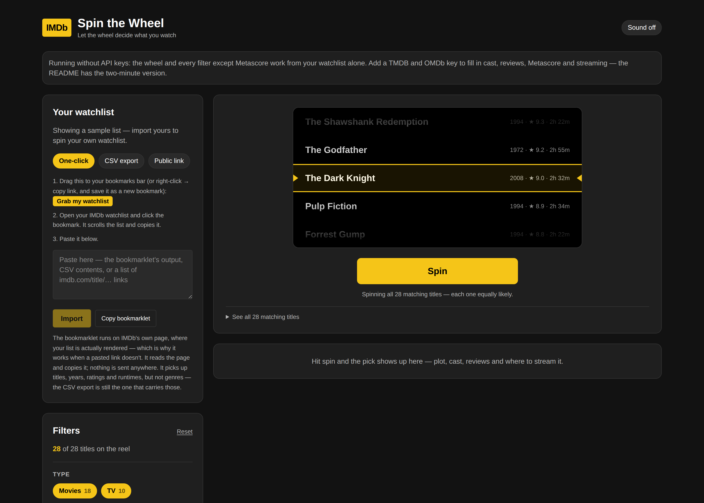

# IMDb Spin the Wheel

Load your IMDb watchlist, filter it down to what you're in the mood for, and let a
wheel pick what you watch. When it lands you get the plot, cast, critic and
audience scores, what reviewers liked and didn't, and where to stream it.



## Quick start

```bash
npm install
cp .env.example .env.local   # optional — see "API keys" below
npm run dev
```

Then open <http://localhost:3000>. It starts on a sample watchlist so you can try
the wheel straight away; import yours to replace it.

## Getting your watchlist in

IMDb has no public API, and it renders watchlist pages in the browser — a
server-side fetch gets a 2 KB shell with no titles in it. So the import happens
either in your browser or from a file. Three ways, best first:

**One-click bookmarklet (recommended).** Drag the yellow button from the app to
your bookmarks bar. Then open your IMDb watchlist, click the bookmark, and paste
the result into the app. It scrolls the list, reads it from the rendered page,
and copies it — nothing is uploaded anywhere. You get titles, years, ratings,
runtimes and types, but not genres.

**CSV export (the one with genres).** On IMDb, open your Watchlist, use the `⋯`
menu and choose **Export**. IMDb prepares the file on its
[exports page](https://www.imdb.com/exports/) — download it, then either drop it
on the app or paste its contents into the same box. This is the only route that
carries genres, so it's the one to use if you want the genre filter.

**Public list link.** A `ur…`/`ls…` id or URL, fetched server-side. This does
*not* work for personal watchlists — IMDb serves that placeholder shell — and the
app now says so plainly rather than guessing. Older public `ls…` lists may still
work.

The paste box takes any of it: the bookmarklet's JSON, CSV contents, or a rough
list of `imdb.com/title/…` links. It sniffs the format rather than making you
pick one.

Whatever you import is kept in `localStorage`, and the last link you used is
remembered so a re-sync is one click.

## Filters

| Filter | Where the data comes from |
| --- | --- |
| Movies / TV / Other | Title type — from any import |
| Genre (any or all) | Genres — **CSV export only** |
| Minimum IMDb rating | IMDb rating — from any import |
| Minimum Metascore | Fetched from OMDb on demand |

An import without genres turns the genre filter off rather than showing an empty
one, and the app says which import you're on.

IMDb exports don't include Metascores, so they're fetched only once you actually
raise that slider, and only for titles that already clear your other filters —
that keeps a big watchlist from burning through a daily API quota. Titles whose
score hasn't been looked up yet are governed by **Keep titles with no rating**.

**Skip my last few winners** holds back the last five results so the same film
doesn't keep coming up. If it ever empties the pool, the app falls back to the
unfiltered pool rather than leaving you with an empty wheel.

## API keys

Both are optional and free. Without them the wheel, the type filter, the genre
filter and the IMDb rating filter all work from your export alone.

| Variable | Unlocks | Get one |
| --- | --- | --- |
| `OMDB_API_KEY` | Metascore, certificate, awards, Rotten Tomatoes score, full plot | [omdbapi.com](https://www.omdbapi.com/apikey.aspx) |
| `TMDB_ACCESS_TOKEN` *or* `TMDB_API_KEY` | Cast, reviews, trailer, where to watch | [themoviedb.org](https://www.themoviedb.org/settings/api) |

Put them in `.env.local`. They're only ever read on the server — the browser is
told whether a key exists, never what it is. TMDB's v4 read access token is
preferred when both TMDB variables are set.

Streaming availability comes from JustWatch via TMDB and is region-specific;
pick your region on the result panel and it's remembered.

## How the pick is made

The reel scrolls rows past a marker band rather than fitting them around a
circle, so it spins your **entire** filtered list — nothing is left off to keep
it readable. The winner is drawn uniformly with `crypto.getRandomValues`
(rejection-sampled, so no modulo bias) before the animation starts, and the reel
is animated to land on it. It holds that position afterwards so the result stays
in the marker band.

## Scripts

```bash
npm run dev        # dev server
npm run build      # production build
npm run start      # serve the production build
npm run lint       # eslint
npm run typecheck  # tsc --noEmit
npm test           # vitest
```

## Project layout

```
src/
  app/
    page.tsx                  server component; reports which API keys are set
    api/watchlist/            imports a public IMDb list server-side
    api/title/[id]/           merges OMDb + TMDB into one detail payload
    api/metascores/           batched Metascore lookups
  components/
    AppShell.tsx              state, filtering, spin orchestration
    Wheel.tsx                 canvas wheel and spin animation
    Filters.tsx               filter controls
    ResultPanel.tsx           the result: cast, reviews, where to watch
    WatchlistImport.tsx       CSV and link import
  lib/
    csv.ts                    RFC 4180 reader + IMDb export mapping
    paste.ts                  sniffs pasted JSON / CSV / links into items
    bookmarklet.ts            the script that reads IMDb's rendered page
    imdbList.ts               public list fetching and page parsing
    omdb.ts / tmdb.ts         upstream clients
    details.ts                merges both into one shape
    filters.ts                filtering and facet counts
    random.ts                 uniform picks and sampling
tests/                        vitest unit tests
```

## Deploying

It's a stock Next.js app, so anywhere that runs Next works. On Vercel, import the
repo and add `OMDB_API_KEY` and `TMDB_ACCESS_TOKEN` as environment variables. The
home page is rendered per request so key changes take effect without a rebuild.

## Notes and limits

- IMDb has no public API. Nothing here signs into IMDb or touches a private
  watchlist — the CSV export is the supported path, and the link importer only
  reads public pages.
- The sample watchlist's ratings are a point-in-time snapshot and will drift from
  IMDb. Your own export has the current numbers.
- Reviews come from TMDB and are split by the reviewer's own score: 7+ counts as
  liked, 5 or below as not. Titles with few TMDB reviews will show thin results —
  the panel links straight to IMDb's 10-star and 1-star reviews as well.
